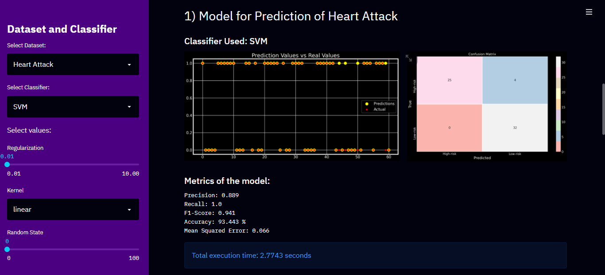
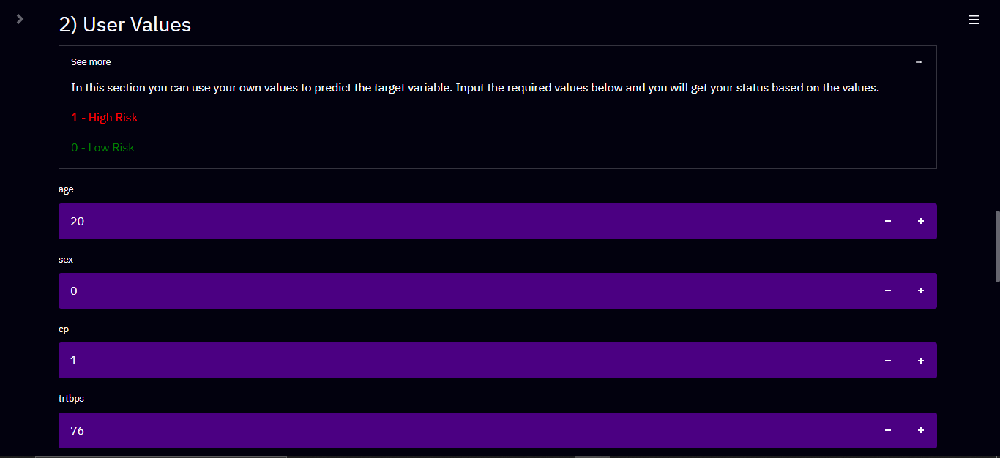
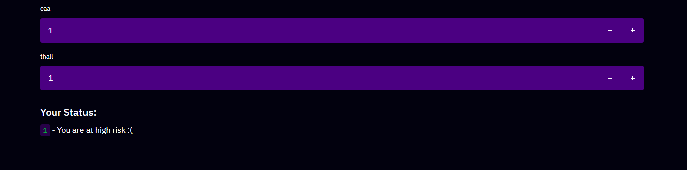
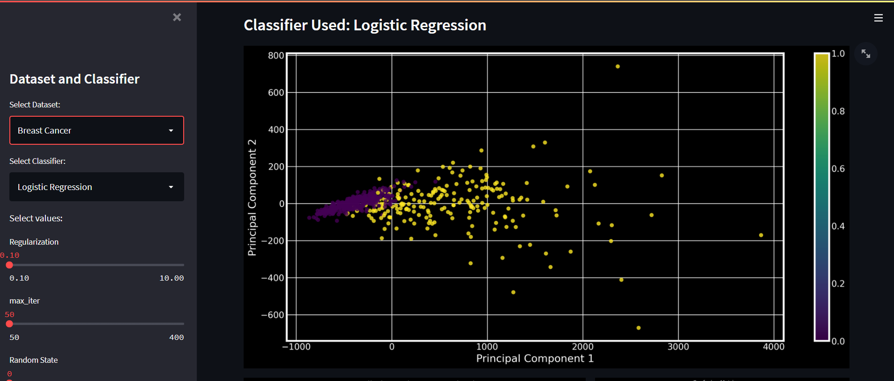

# Healthcare Machine Learning app

This is an interactive Machine Learning Web App "ML in Healthcare" developed using Python and StreamLit. It uses ML algorithms to build powerful and accurate models to predict the risk (High / Low) of the user of having a Heart Attack or Breast Cancer based on the user's specific attributes like age, sex, heart rate, blood sugar, etc.

The app can be visited at https://ml-healthcare-streamlit.herokuapp.com/

# About the App
The app has 2 major sections, first being Model Building.
In this section 7 different models are built using different ML algorithms. They are:
1. Logistic Regression 
2. KNN
3. SVM 
4. Decision Trees 
5. Random Forest 
6. Gradient Boosting 
7. XGBoost
   
An interactive side-dashboard is created using the streamlit st.sidebar call which enables the user to do the following:

1. Choose dataset - Heart Attack / Breast Cancer
2. Choose algorithm - Logistic Regression , KNN , SVM , Decision Trees , Random Forest , Gradient Boosting , XGBoost.
3. Change the important parameters for each model - Learning Rate, Random State, Regularization Coeff, Gamma, Kernel, n_estimators etc.

After training using the parameters selected by the user, the tuned model is built and ready to be tested on our testing data. The classification plot and confusion matrix is displayed for the model selected along with the model metrics: Accuracy, Precision, Recall, F1-Score, Mean Squared Error, Execution Time. The user can observe real-time changes in the plots and metrics as they change the model parameters further.

The next section being USer Prediction.
In this section, the user can use any model developed above to predict their status (High Risk / Low Risk) using their own values. (Either for Heart Attack or Breast Cancer)

# Screenshots of the web app:

<table style="width:100%">
  <tr>
    <th></th>
    <th></th>
  </tr>
  <tr>
    <th></th>
    <th></th>
  </tr>
 </table>
 
 
 # Flow Chart
 
 <table style="width:100%" align="center">
  <tr>
    <th></th>
  </tr>
 </table>

#  Data Source

The models are trained using data from https://archive.ics.uci.edu/ml/index.php, particularly the Heart Attack Prediction and Breast Cancer (Wisconsin) datasets.